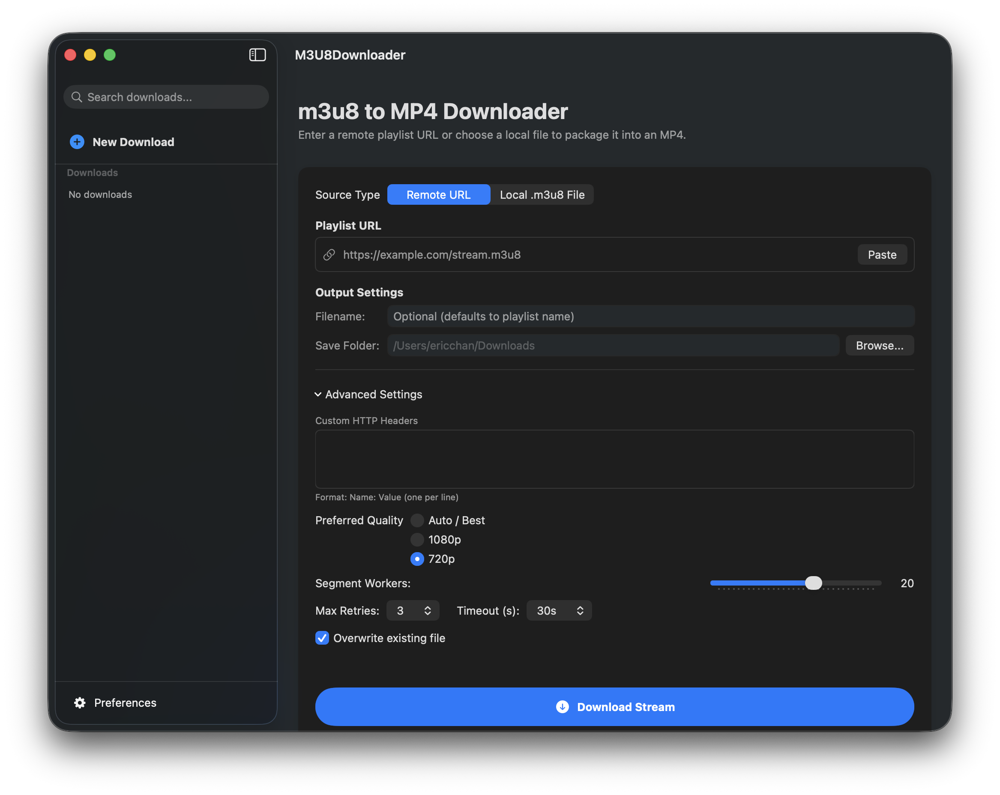

# m3u8 Downloader

[English](README.md) | [简体中文](README.zh-CN.md) | [日本語](README.ja.md)

Download an HLS `.m3u8` stream, clean and prepare its media segments locally,
then package the result as an `.mp4` with `ffmpeg`.

(Different to ffmpeg: Support m3u8 with fake image headers, and cleanup segments with invalid prefix.)

The repository now includes three ways to use the downloader:

- A native SwiftUI macOS app in `M3U8Downloader/`.
- A Python command-line downloader in `download_m3u8.py`.
- A small local Flask web UI in `web_app.py`.

The downloader is intended for streams you are allowed to download. It does not
bypass DRM or other access controls.

## Native macOS App

<p>
  
  
  
  
  
</p>

`M3U8Downloader` is a SwiftUI app for macOS that wraps the downloader workflow in
a desktop interface. It accepts either a remote playlist URL or a local `.m3u8`
file, downloads and cleans the HLS segments, and calls `ffmpeg` to package the
final MP4.



### App Features

- Remote URL and local `.m3u8` file sources.
- Output filename and save-folder selection.
- Custom HTTP headers, one `Name: Value` header per line.
- Preferred quality selection for master playlists: Auto / Best, 1080p, or 720p.
- Segment worker, retry, timeout, and overwrite controls.
- Download queue sidebar with search.
- Per-download progress, segment counts, FFmpeg logs, retry, cancel, Show in
  Finder, and Open Video actions.
- Preferences for `ffmpeg` path and the default download folder.

### macOS Requirements

- macOS 14 or newer.
- Xcode with the macOS SDK.
- `ffmpeg` installed locally.

Install `ffmpeg` with Homebrew if needed:

```bash
brew install ffmpeg
```

The app auto-detects common `ffmpeg` locations:

- `/opt/homebrew/bin/ffmpeg`
- `/usr/local/bin/ffmpeg`
- `/usr/bin/ffmpeg`
- `ffmpeg` from `PATH`

You can override the path in the app Preferences screen.

### Build The App

The Xcode project is checked in at:

```text
M3U8Downloader/M3U8Downloader.xcodeproj
```

Build from the terminal:

```bash
cd M3U8Downloader
./build.sh
```

The script builds the `M3U8Downloader` scheme in Debug configuration and moves
the resulting app bundle to the repository root:

```text
M3U8Downloader.app
```

You can also open the project in Xcode:

```bash
open M3U8Downloader/M3U8Downloader.xcodeproj
```

Then select the `M3U8Downloader` scheme and run it.

### Run The App

After building, launch the app from the repository root:

```bash
open ./M3U8Downloader.app
```

To download a stream:

1. Choose `Remote URL` or `Local .m3u8 File`.
2. Enter the playlist URL or browse to a local playlist.
3. Choose an output filename and save folder.
4. Expand Advanced Settings when you need headers, quality, worker, retry, or
   timeout options.
5. Click `Download Stream`.

Completed jobs can be opened in Finder or played directly from the job detail
screen.

### Regenerate The Xcode Project

The app also includes an XcodeGen spec:

```text
M3U8Downloader/project.yml
```

If you update the project structure and want to regenerate the `.xcodeproj`,
install XcodeGen and run:

```bash
cd M3U8Downloader
xcodegen generate
```

## Python CLI

The CLI downloads remote playlists segment-by-segment, strips a small fake image
header from segments when present, writes a cleaned local playlist, then uses
`ffmpeg` to combine the local playlist into the final MP4.

### CLI Requirements

- Python 3.
- `ffmpeg` available on your `PATH`.

### CLI Usage

Download a remote playlist:

```bash
python3 download_m3u8.py "https://cdn3.turboviplay.com/data1/685f4c3d5bc66/685f4c3d5bc66.m3u8"
```

By default, MP4s are saved in your user Downloads folder, such as
`/Users/ericchan/Downloads/`, using the playlist filename.

Save with a custom output filename:

```bash
python3 download_m3u8.py "https://cdn3.turboviplay.com/data1/685f4c3d5bc66/685f4c3d5bc66.m3u8" -o sample.mp4
```

Download from a local `.m3u8` playlist file:

```bash
python3 download_m3u8.py ./video.m3u8 -o video.mp4
```

Pass headers when a stream requires them:

```bash
python3 download_m3u8.py "https://example.com/video.m3u8" \
  --header "Referer: https://example.com" \
  --header "User-Agent: Mozilla/5.0" \
  -o video.mp4
```

Avoid overwriting an existing file:

```bash
python3 download_m3u8.py "https://example.com/video.m3u8" -o video.mp4 --no-overwrite
```

Prefer a 720p or 1080p stream when the master playlist offers one:

```bash
python3 download_m3u8.py "https://example.com/video.m3u8" --quality 1080p -o video.mp4
```

Tune segment downloading:

```bash
python3 download_m3u8.py "https://example.com/video.m3u8" \
  --segment-workers 12 \
  --retries 4 \
  --timeout 20 \
  -o video.mp4
```

Segments are downloaded concurrently and timeout failures are retried.

## Local Web UI

Install the UI dependency:

```bash
python3 -m pip install -r requirements.txt
```

Start the local server:

```bash
python3 web_app.py
```

Open `http://127.0.0.1:5000` in your browser. The UI lets you queue downloads
from either a remote m3u8 URL or an uploaded local `.m3u8` file, set the same
options as the CLI, watch live logs, see the local saved path, and download a
completed MP4 through the browser.

The web app is intended for local use and binds to `127.0.0.1`.

## Tests

Use the repository virtual environment for tests:

```bash
./.venv/bin/python3 -m pytest
```

## License

m3u8Downloader is released under the MIT License. See [LICENSE](LICENSE).
